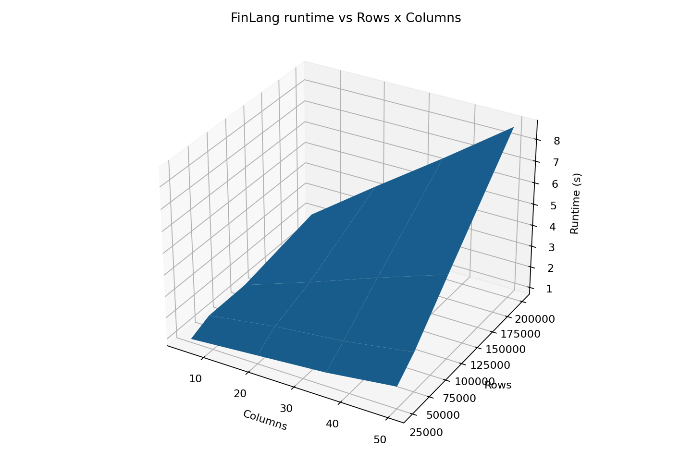
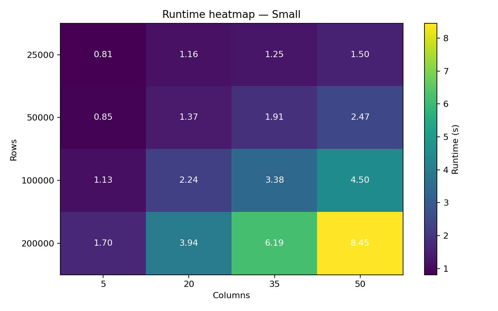
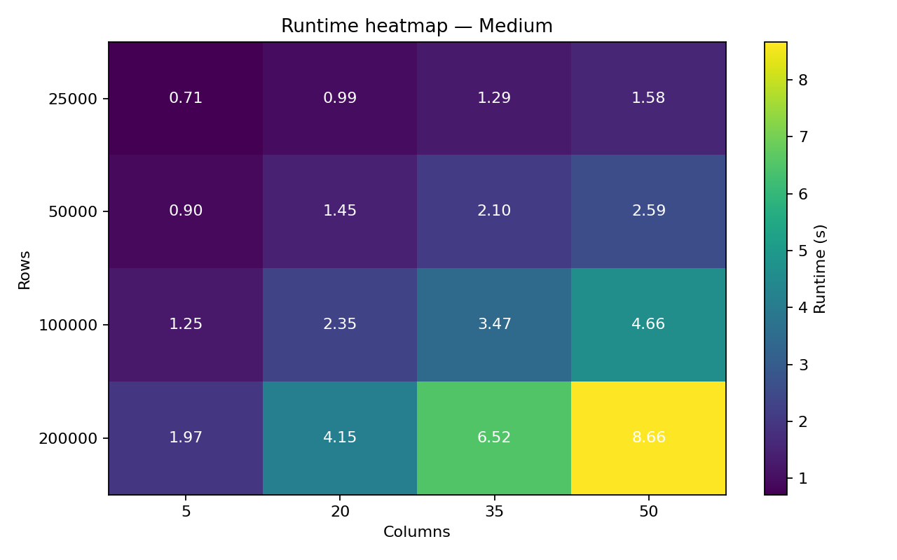
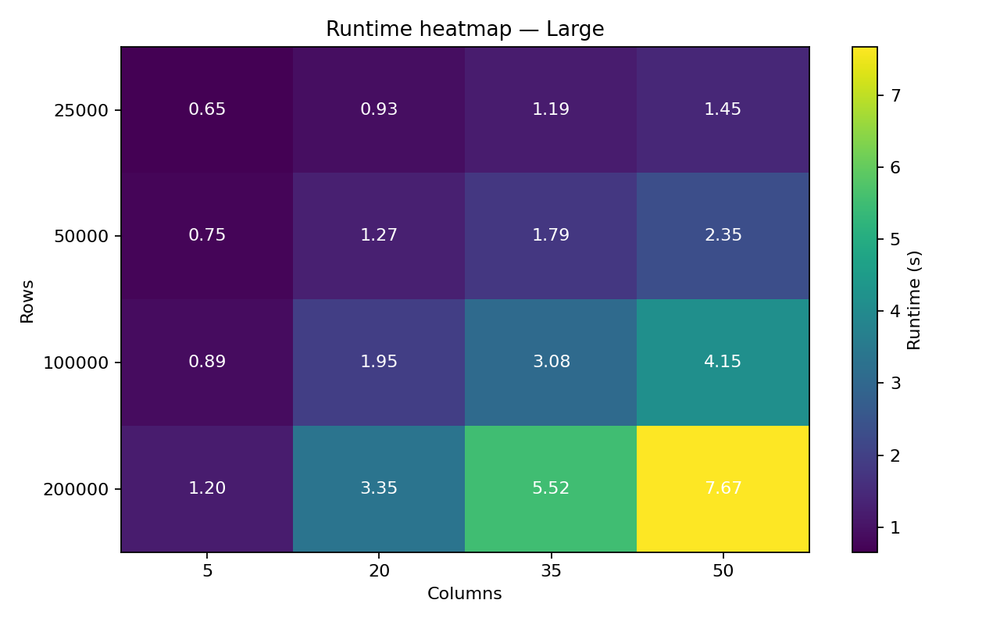

# 📊 FinLang Benchmarks
> **Applies to:** FinLang v0.7.7+  
> **Status:** Reference  
> **Last verified:** v0.8.2 (20 July 2026 — 20M-row integrity harness re-validated; the full benchmark suite below remains the v0.7.7 baseline)

This guide presents validated benchmark data for FinLang v0.7.7, tested on a real developer workstation, plus the v0.8.2 20M re-validation.

---

## ⚙️ Test Environment

- **CPU:** Intel i7‑12700T (12th Gen)  
- **RAM:** 48 GB  
- **OS:** Windows 11 (64‑bit)  
- **Python:** 3.13.7 (64‑bit)  
- **Backend:** FastIO (PyArrow 21.0.0)
- **FinLang:** 0.7.7 (installed from PyPI)

> Your absolute numbers may differ based on CPU, storage, and OS. Focus on **shape** (linear scaling) and **relative** performance.

---

## 🚀 v0.7.7 Performance Highlights

v0.7.7 contains a hot-path bug fix in `_to_number` (the function that runs on every amount value). The CR/DR detection regex contained an unnecessary `\b` word boundary that was both:

1. **Producing wrong results** on no-space CR/DR formats like `200DR` (silently emitting +200 instead of -200, latent since v0.6.4)
2. **Costing measurable runtime** by forcing per-character boundary assertions on every regex evaluation

Removing the `\b` aligned the detection regex with its sibling stripping regex (which never had `\b` and worked correctly). The fix is a single character change. The performance gain is a direct side effect.

**Headline numbers:**
- **Standard mode: ~180K rows/sec** (steady-state from 5M rows upwards)
- **FastIO mode: ~217K rows/sec** at 20M rows
- **20M rows in ~90 seconds** (FastIO), full field-by-field SHA-256 verified
- **+30-50% throughput improvement** vs v0.7.6 on the integrity harness

---

## ✅ v0.8.2 Re-validation (20 July 2026)

The 20M-row integrity harness was re-run against FinLang 0.8.2 on the same workstation class (clean boot, background services stopped), with full field-by-field validation enabled explicitly:

```
python integrity_testv2.py --rows 20000000 --full
```

| Mode | v0.7.7 baseline | v0.8.2 measured | Result |
|:--|:--|:--|:--|
| Standard | 181,566 rows/s | 179,668 rows/s | PASS — 20,000,000 rows, full field-by-field |
| FastIO | 217,068 rows/s | **226,871 rows/s** | PASS — 20,000,000 rows, full field-by-field |

All 20M fingerprints validated, no cross-row contamination, immutable fields (date, amount, counterparty) verified. A repeat run tracked consistently (standard 182,646 rows/s; FastIO 226,589 rows/s). The engine's categorisation path is unchanged since the v0.8.1 hardening release — v0.8.2's change is confined to `--verify` (see [verify.md](verify.md) § Performance) — so these figures confirm continuity at scale rather than a performance change.

---

## 🧪 Benchmark Harnesses

### 1) Single Ruleset Harness — scaling across Rows × Cols

Evaluates performance for a single static ruleset over a grid of dataset sizes and column widths.

```powershell
python -m benchmarks.bench_finlang_harness `
  --mode full-cli `
  --run-fin "finlang --fastio --audit-mode none --headless" `
  --rules examples/rules.demo.fin `
  --include-pack retail,transport,subs `
  --rows 25000 50000 100000 200000 `
  --cols 5 20 35 50 `
  --runs 3 `
  --final-rows 1000000 5000000 `
  --outdir bench_out_v077
```

**Outputs:**
- `bench_surface.png` — 3D runtime surface  
- `bench_heatmap.png` — runtime heatmap  
- `bench_results.csv` — raw timings (averaged over 3 runs)
- `bench_big.csv` — finals (1M and 5M rows)

---

### 2) Ruleset Comparison Harness — small vs medium vs large rules

Measures runtime impact of ruleset size/complexity.

```powershell
python -m benchmarks.bench_finlang_rulesets `
  --run-fin "finlang --fastio --audit-mode none --headless" `
  --rules-set Small:examples/rules.demo.fin `
  --rules-set Medium:src/finlang/rulepacks/01-vendors-retail.fin `
  --rules-set Large:src/finlang/rulepacks/03-subscriptions.fin `
  --include-pack transport `
  --grid-rows 25000 50000 100000 200000 `
  --grid-cols 5 20 35 50 `
  --repeats 3 `
  --final-rows 1000000 5000000 `
  --outdir bench_out_rulesets_v077
```

**Outputs:**
- `heatmap_Small.png`, `heatmap_Medium.png`, `heatmap_Large.png`
- `results_all.csv`, `finales.csv`

---

### 3) Integrity Test — cryptographic verification at scale

Validates data integrity with SHA-256 fingerprinting. Proves zero data corruption or cross-row contamination.

```powershell
# Default: 5K rows, fingerprint-only (daily use)
python integrity_testv2.py

# Full validation: field-by-field + fingerprint
python integrity_testv2.py --full

# Scale testing
python integrity_testv2.py --rows 20000000 --full

# Generate annotated proof CSV (demo/audit collateral)
python integrity_testv2.py --rows 500000 --full --proof
```

**What it proves:**
- Row count preserved (no dropped/duplicated rows)
- Immutable fields unchanged (`date`, `amount`, `counterparty`)
- SHA-256 fingerprint per row validates no cross-row contamination
- Both code paths (standard + PyArrow) produce identical results

---

## 📈 Validated Results (v0.7.7)

### Single Ruleset Performance — Grid (3-run average)

| Rows × Cols | Runtime (s) | Throughput (rows/s) |
|---:|---:|---:|
| 25K × 5  | 0.69 | 36,200 |
| 25K × 20 | 0.95 | 26,300 |
| 25K × 35 | 1.20 | 20,800 |
| 25K × 50 | 1.51 | 16,600 |
| 50K × 5  | 0.75 | 66,800 |
| 50K × 20 | 1.29 | 38,800 |
| 50K × 35 | 1.85 | 27,100 |
| 50K × 50 | 2.37 | 21,100 |
| 100K × 5  | 0.92 | 108,500 |
| 100K × 20 | 1.98 | 50,600 |
| 100K × 35 | 3.08 | 32,500 |
| 100K × 50 | 4.18 | 23,900 |
| 200K × 5  | 1.24 | 160,800 |
| 200K × 20 | 3.38 | 59,200 |
| 200K × 35 | 5.61 | 35,700 |
| 200K × 50 | 7.96 | 25,100 |

### Single Ruleset Performance — Finals (3-run average)

| Rows × Cols | Runtime (s) | Throughput (rows/s) |
|---:|---:|---:|
| 1M × 5 | 3.84 | 260,400 |
| 1M × 20 | 15.04 | 66,500 |
| 1M × 50 | 36.28 | 27,600 |
| 5M × 5 | 17.66 | 283,100 |
| 5M × 20 | 71.55 | 69,900 |
| **5M × 50** | **179.27** | **27,900** |

### Ruleset Comparison (5M × 50)

| Ruleset | Runtime (s) | Throughput (rows/s) |
|---------|-------------|---------------------|
| Small | 173.28 | 28,900 |
| Medium | 175.43 | 28,500 |
| Large | 174.97 | 28,600 |

**Key finding:** ~1.2% variance across rulesets — rule complexity has negligible impact at scale.

> All three rulesets land within ~2 seconds of each other at the 5M × 50 extreme. The engine's hot path is ruleset-shape-independent at scale.

---

## 🔐 Integrity Test Results (v0.7.7)

Cryptographic verification using SHA-256 fingerprints on every row.

### Performance by Scale

| Rows | Generation | Engine (std) | Engine (fast) | Validation (full) | Total |
|------|------------|--------------|---------------|-------------------|-------|
| 5M | 18.1s | 27.9s (**178,903 rows/s**) | 25.2s (**198,448 rows/s**) | ~3.1m | ~5 min |
| 10M | 37.4s | 56.0s (**178,511 rows/s**) | 46.7s (**214,136 rows/s**) | ~6.0m | ~10 min |
| **20M** | **1.2m** | **1.8m (181,566 rows/s)** | **1.5m (217,068 rows/s)** | **~11.8m** | **~18 min** |

### 20M Row Validation — Full Output

```
=== FinLang Data Integrity Test (Python) ===
  Row count: 20,000,000
  Validation mode: Full (field-by-field + fingerprint)
  PyArrow available: Yes
  Proof output: No
[1/6] Generating 20,000,000 test rows with fingerprints... OK (1.2m)
[2/6] Creating test rules... OK
       Loading input data for validation... OK (20.9s)
[3/6] Running FinLang engine (standard)... OK (1.8m, 181,566 rows/s)
[4/6] Validating integrity (standard, full)... OK (20,000,000 categorized, 5.9m)
[5/6] Running FinLang engine (--fastio)... OK (1.5m, 217,068 rows/s)
[6/6] Validating integrity (--fastio, full)... OK (20,000,000 categorized, 5.9m)
=== Integrity Test PASSED ===
  Rows tested: 20,000,000
  Immutable fields verified: date, amount, counterparty
  Fingerprints validated: 20,000,000 (no cross-row contamination)
  Validation mode: Full (field-by-field + fingerprint)
  Standard mode: PASS (181,566 rows/s)
  FastIO mode:   PASS (217,068 rows/s)
```

### Why Integrity Test Shows Higher Throughput

The integrity test uses a **minimal 6-column schema** (date, amount, counterparty, memo, category, fingerprint) versus the benchmark harness's **50-column enterprise schema**.

| Test Type | Columns | Throughput (FastIO) |
|-----------|---------|---------------------|
| Integrity test | 6 | 217K rows/s |
| Enterprise benchmark | 50 | ~28K rows/s |

This is expected: narrower data = less I/O, less memory pressure, faster processing. Both numbers are valid for their respective use cases. The integrity test isolates engine performance from CSV I/O overhead; the enterprise harness measures real-world end-to-end throughput.

---

## 📊 Version Comparison

### Integrity Harness (FastIO, full validation)

| Scale | v0.7.6 (std) | v0.7.7 (std) | Std Δ | v0.7.6 (fast) | v0.7.7 (fast) | Fast Δ |
|---:|---:|---:|---:|---:|---:|---:|
| 5M | 128K rows/s | **179K rows/s** | **+39.8%** | 133K rows/s | **198K rows/s** | **+49.2%** |
| 10M | 122K rows/s | **179K rows/s** | **+46.3%** | 156K rows/s | **214K rows/s** | **+37.3%** |
| 20M | 146K rows/s | **182K rows/s** | **+24.4%** | 167K rows/s | **217K rows/s** | **+30.0%** |

### Single Ruleset Harness (5M × 50)

| Version | Runtime (s) | Throughput |
|---|---|---|
| v0.6.4 | 208.31 | ~24K rows/s |
| v0.7.2 | 187.76 | ~26.6K rows/s |
| v0.7.4post1 | 187.90 | ~26.6K rows/s |
| **v0.7.7** | **179.27** | **~27.9K rows/s** |

**Cumulative gain v0.6.4 → v0.7.7:** -14% runtime, +16% throughput on the enterprise harness.

### What Changed in v0.7.7

The improvement is dominated by a single hot-path fix in `_to_number`:

```python
# v0.6.4 - v0.7.6 (broken on no-space CR/DR formats)
r'\b(?:CR|CRED|CREDIT)\b\.?\s*$'

# v0.7.7 (correct)
r'(?:CR|CRED|CREDIT)\.?\s*$'
```

The `\b` word boundary was inconsistent with the sibling stripping regex (which never had `\b`), causing `200DR` to be silently parsed as +200 instead of -200. Removing it:
- Fixed the correctness bug
- Removed per-character boundary assertions from a regex evaluated tens of millions of times per dataset
- Delivered 30-50% throughput improvement on the integrity harness

The performance gain is a direct side effect of the bug fix, not a separate optimisation.

---

## 🖼️ Visual Results

| Visualization | Description |
|---|---|
|  | 3D runtime surface (Rows × Cols) |
|  | Runtime heatmap (Rows × Cols) |
|  | Ruleset comparison — Small |
|  | Ruleset comparison — Medium |
|  | Ruleset comparison — Large |

---

## 🔬 Methodology Notes

- **3 runs per point**, average reported to smooth variance  
- Warm runs (Chrome closed, system idle)
- `--audit-mode none` to measure engine speed (no audit overhead)  
- PyArrow (`--fastio`) enabled for CSV I/O  
- Deterministic data generation, reproducible CLI scripts
- All v0.7.7 runs from PyPI-installed package (`pip install "finlang[fastio]"`)
- Run-to-run variance under 1.5% on the 5M × 50 finale (179.27s averaged across 3 runs)

---

## 💡 Practical Interpretation

| Scenario | Example Dataset | Expected Runtime |
|---|---|---|
| Personal finance | 25K × 20 | < 1s |
| Small business | 500K × 35 | ~14s |
| Enterprise ledger | 5M × 50 | ~3 min |
| Full year bank data | 20M × 6 | ~18 min (with integrity verification) |

**Rule of thumb:** FinLang scales linearly — doubling rows ≈ doubling runtime; increasing columns raises evaluation cost predictably.

---

## 🧩 Troubleshooting

| Issue | Symptom | Fix |
|---|---|---|
| "PyArrow missing" | `ImportError: No module named pyarrow` | `pip install "finlang[fastio]"` |
| "Encoding error" | Garbled text | Add `--encoding auto` |
| Slow performance | Lower than expected throughput | Ensure `--fastio` is present; close background apps |
| CPU power limits | Runtime > expected | Disable power saving / thermal throttling |

---

## 📚 Related Documentation

- [CLI Reference](cli_reference.md) — Complete command reference
- [Runtime Contract](runtime_contract.md) — Backend selection logic
- [Flags](flags.md) — Full CLI flags and canonical formats  
- [Workflows](workflows.md) — End‑to‑end workflow guide
- [Release Notes v0.7.7](release_notes/release_notes_v0_7_7.md) — Bug fix and performance details
