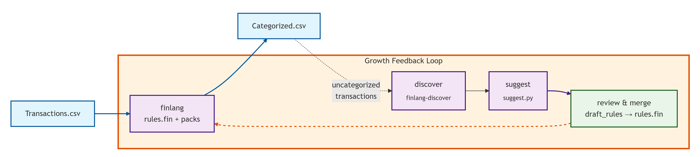
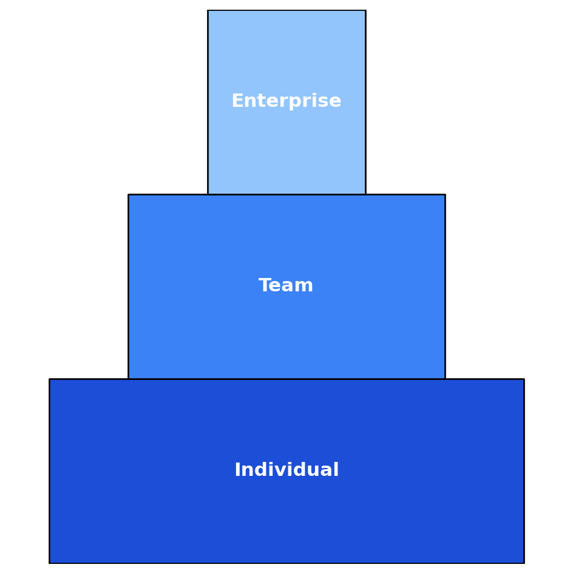

# 📖 Core Workflows
*Applies to FinLang v0.6.x*

This guide shows how to use **FinLang** day-to-day — from basic categorization runs to iterative rule growth and high-scale benchmarking. It’s recipe-driven, with practical examples you can run immediately.

---

## Daily Run

The **Daily Run** is your standard workflow: apply your personal rules plus optional starter packs to new transaction data.

### Example

```bash
finlang --input transactions.csv --output categorized.csv   --rules my_rules.fin --include-pack retail,sanity   --fastio --audit audit.json --audit-mode lite
```

### What’s Happening
- `transactions.csv` → raw bank export (FinLang normalizes headers automatically).
- `my_rules.fin` → your personal ruleset (highest precedence).
- `--include-pack retail,sanity` → adds baseline packs for coverage and sanity checks.
- `--audit audit.json --audit-mode lite` → logs changed cells for traceability (`lite` = only changed cells).  
- `--fastio` → speeds up CSV IO with `pyarrow`.

### When to Use
- Daily or weekly transaction categorization.
- Producing audit trails for compliance or bookkeeping.
- Fast, reliable updates with minimal overhead.

---

## Growth Loop

The **Growth Loop** helps you iteratively improve your rule coverage by identifying and fixing uncategorized transactions. It’s a cycle of: process → discover → suggest → review/merge → re-run.



---

### Step 1: Initial Processing

```bash
finlang --input transactions.csv --output categorized.csv   --rules my_rules.fin --include-pack retail,sanity   --fastio --audit audit.json --audit-mode lite
```

- Applies your rules + optional packs.
- Produces `categorized.csv` in canonical form.
- Some rows will remain uncategorized — these are what we target.

---

### Step 2: Discover Candidates

```bash
finlang-discover --input categorized.csv   --candidates discovery/candidates.csv   --all discovery/all_candidates.csv   --min-count 5
```

- Scans uncategorized rows in `categorized.csv`.
- Surfaces frequent counterparties into `candidates.csv`.
- Full frequency table written to `all_candidates.csv`.

---

### Step 3: Suggest Draft Rules

```bash
finlang-suggest --input discovery/candidates.csv   --output draft_rules.fin   --rules my_rules.fin   --category "Review"   --prefix "SUGGEST"
```

- Generates conservative draft rules in `.fin` syntax.
- **Intelligently de-duplicates:** By referencing your `my_rules.fin`, it skips any patterns already covered, so you don’t get redundant suggestions.
- Default category = `"Review"` (safe placeholder).

---

### Step 4: Review & Merge (Manual)

Open `draft_rules.fin` in your editor:

- Replace placeholder `"Review"` with specific categories (e.g., `"Groceries"`).  
- Add flags (`flags += "subscription"`, etc.).  
- Adjust overly broad wildcard matches.  

When satisfied, append to your main ruleset:

**mac/Linux (bash/zsh):**
```bash
cp my_rules.fin{,.bak} && cat draft_rules.fin >> my_rules.fin
```

**Windows CMD:**
```cmd
copy my_rules.fin my_rules.bak && type draft_rules.fin >> my_rules.fin
```

**PowerShell:**
```powershell
Copy-Item my_rules.fin -Destination my_rules.bak
Get-Content draft_rules.fin | Add-Content my_rules.fin
```

---

### Step 5: Re-run with Full Audit

```bash
finlang --input transactions.csv --output categorized.csv   --rules my_rules.fin --include-pack retail,sanity   --audit audit.json --audit-mode full
```

- Validates new rules against your dataset.
- **Audit mode `full`** → records before/after snapshots of all evaluated cells.

---

🔁 Repeat the loop regularly → coverage improves, manual work decreases, and your ruleset grows smarter over time.

---

## Benchmarking

Benchmarking shows how FinLang scales with large datasets. Use this to validate performance in your environment or compare rulesets.

### Single-Ruleset Harness

```bash
python -m benchmarks.bench_finlang_harness   --mode full-cli   --run-fin "finlang --fastio --audit-mode none --headless"   --rules examples/rules.demo.fin   --rows 25000 50000 100000 200000   --cols 5 20 35 50   --runs 3   --final-rows 1000000 5000000   --outdir bench_out
```

- `--rows` / `--cols` → synthetic grid sizes.
- `--runs 3` → repeat each grid point for stability.
- `--final-rows` → stress tests (1M, 5M rows).
- `--outdir` → saves CSV + plots.

**Outputs**
- `bench_results.csv` → timings data.
- `bench_heatmap.png` → visual performance by row/col.
- `bench_surface.png` → 3D surface plot.
- Finale plots → large-row stress runs.

### Multi-Ruleset Comparator

```bash
python -m benchmarks.bench_finlang_rulesets \
  --run-fin "finlang --fastio --audit-mode none" \
  --rules-set RETAIL:src/finlang/rulepacks/01-vendors-retail.fin \
  --rules-set TRANSPORT:src/finlang/rulepacks/02-transport.fin \
  --rows 50000 100000 --cols 10 20 --repeats 3 --outdir bench_out
```

- Compare performance across multiple named rulesets.
- Produces side-by-side plots for fair comparison.

---

## Quick Reference

- **Daily Run** → apply rules + packs with lite audit.  
- **Growth Loop** → process → discover → suggest → review/merge → re-run.  
- **Benchmarking** → stress test scaling and compare rulesets.  

---

## Next Steps

- Explore the **[Rule Language](rule_language.md)** for advanced rule writing.
- See the **[CLI Reference](cli_reference.md)** for all flags and switches.
- Check the **[FAQ](faq.md)** if you hit issues.

---

## 📈 Coverage Improvement Tracking (Business Impact)

FinLang isn’t just a rules engine — it’s a **coverage accelerator**. The Growth Loop consistently drives higher automation over time:

- **Week 1**: ~60% automated categorization  
- **Week 4**: ~85% automated categorization  
- **Week 12**: ~95%+ automated categorization  

*Typical results from growth loop iteration. Actual metrics vary by data quality and team discipline.*

---

## 🏢 Enterprise Integration Workflows

FinLang scales from a solo analyst to global finance teams. Recommended practices for enterprise rollout:

### Shared Rulesets
- Store `rules.fin` in Git-based version control (GitHub, GitLab, Bitbucket).  
- Protect main branch with pull requests + reviews.  
- Tag stable versions for audits.

### CI/CD Integration (Current Tip)
You can integrate FinLang into CI/CD pipelines to automatically check rules:

- **Validation (syntax + dry run):**
  ```bash
  finlang --rules my_rules.fin --input sample.csv --output /dev/null --audit-mode none --headless
  ```
  Exits non-zero if rules are invalid or fail to parse.

- **Apply on Sample Data (regression check):**
  ```bash
  finlang --rules my_rules.fin --input sample.csv --output sample_out.csv --audit-mode lite --headless
  ```
  Use diffs on `sample_out.csv` to detect unintended changes.

### Multi-User Collaboration
- Assign different teams specialized rule packs (e.g. Treasury, Compliance, Operations).  
- Merge them into a master `rules.fin` at release time.  
- Use audit JSONs for compliance hand-off.

### Audit Log Storage
- Export audit results to PostgreSQL or Elasticsearch.  
- Enable compliance teams to query, archive, and certify transaction categorization trails.

---

## ⚡ Benchmarking in Business Terms

Benchmarks translate directly into operational capacity:

| Rows × Cols | Runtime | Throughput | Business Context |
| :--- | :--- | :--- | :--- |
| 5M × 5 | ~35s | ~140k rows/s | Daily SME batch processing |
| 5M × 20 | ~95s | ~52.5k rows/s | Real-time payment gateway ingestion |
| 5M × 50 | ~210s | ~23.8k rows/s | Enterprise-scale monthly ledger reconciliation |

**Takeaway:**  
FinLang comfortably supports millions of monthly bank transactions with **<4 minute latency per batch**, enabling near-real-time categorization and audit-grade traceability.

---

## 🗂 Adoption Pyramid



- **Individual:** Run rules locally to automate personal or small-scale workflows.  
- **Team:** Share rules in version control, iterate with the Growth Loop.  
- **Enterprise:** CI/CD integration, shared packs, audit log pipelines, SLA-driven support.

---

© FinLang Ltd
